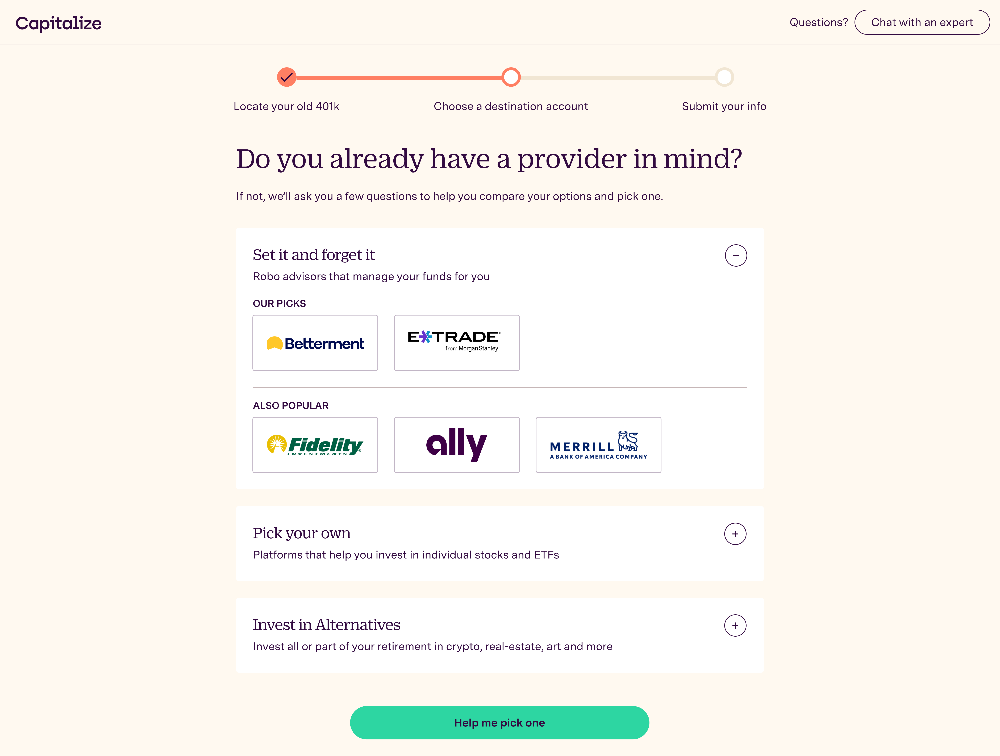
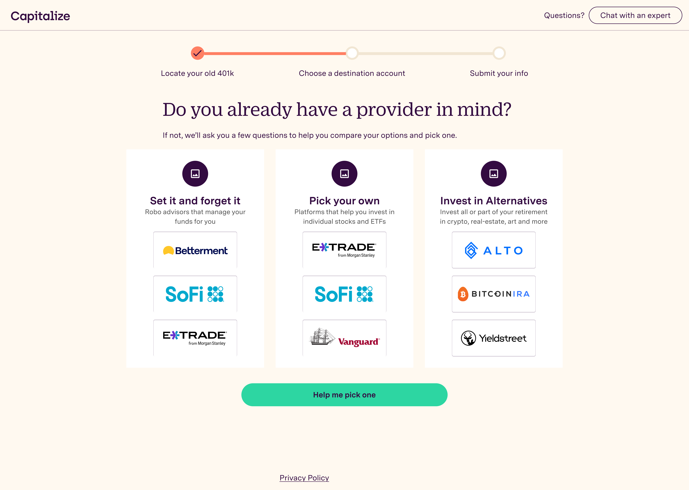
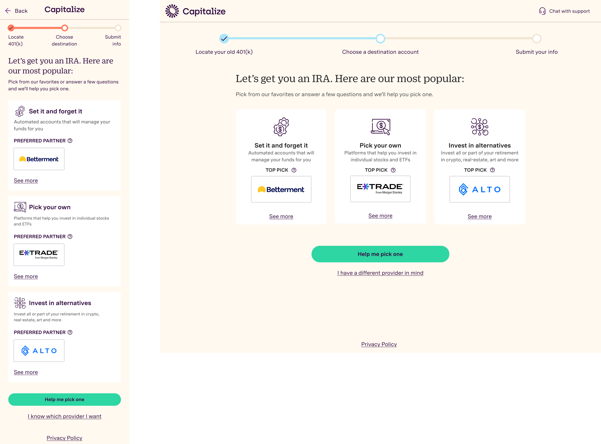

# Background

Capitalize earns a commission when users roll over their 401(k) to a partnered financial institution. We will roll over to any institution, but we only get paid when users select a partner. Encouraging users to choose our partners, without feeling pushy or confusing, was one of the most important UX problems in the funnel.

Previous tests on the partner selection page had not moved the needle, and some had hurt conversion. Stakeholders came to me with a clear request: build a page that grouped all institutions into categories. I wanted to determine whether that was the right answer.

- **Timeline:** Q2 2022
- **Role:** Lead Designer
- **Team Composition:** Product Manager, Engineer, CEO
- **Company:** Capitalize Money

## Goals & Requirements
- Increase monetized rollovers
- Reduce Drop-off
- Don’t negatively impact overall conversion

# Questioning Assumptions

Stakeholders wanted to show every institution at once, organized into labeled groups. The logic made sense on paper: show users every available institution, organized for comparison.

But I wasn't sure that was how people actually made this decision. Before designing anything, I wanted to understand what users were optimizing for when choosing a provider, and whether showing everything would help or overwhelm them.

# Research & Testing

The three categories — Automated, self-directed, and crypto, later renamed *Set it and forget it*, *Pick your own*, and *Invest in alternatives* — were already established before I joined. My job was to find the right way to present them, and to understand why selection numbers weren't moving.

## Round 1: The Fidelity problem

The first version showed all institutions within each category — our picks prominently, with others in a secondary tier below. In UserTesting sessions, a pattern emerged immediately: users weren't reading the categories or comparing options. They were scanning for a logo they recognized and stopping there. If they saw Fidelity, they picked Fidelity. The category structure wasn't guiding the decision — brand recognition was overriding it.

[The Paradox of Choice](https://modelthinkers.com/mental-model/paradox-of-choice) (Iyengar & Lepper's jam study) backed up what we were seeing: more options, less action. The insight pointed to a clear next move: non-partner logos needed to stop competing for attention upfront. Progressive disclosure surfaced here as well: users who didn't recognize the top pick naturally wanted to see more options.

## Round 2: Reducing to one

In the second round, I reduced it to three logos per category with no secondary tier. This was better, but still too much. Users were still making quick pattern-match decisions rather than engaging with the category framing. Three logos had the same problem as nine: the first recognizable logo overall one won.

## Final design

I decided to push this further with one top pick per category, and use "See more" for users who wanted to dig deeper in that category — validating what Round 1 had suggested. Users needed to pick the type before they can see more potentially more recognizable logos. 

Below the three cards: *Help me pick one* (the existing quiz for undecided users) and *I have a different provider in mind* (a text input for users who already knew what they wanted).

The categories always made sense. The format was the problem, and three quick rounds of UserTesting got us to a strong A/B test.

# Outcomes
- **350%+ increase in preferred partner selection** from the logo wall
- No decrease in conversion, NPS, or product satisfaction — we shaped demand without degrading the experience

Users weren't being pushed toward partners — they were being helped to find the one that matched what they already wanted.

## Next Steps
This was a great solution when we had only a few partners. As we partnered with more IRA companies, we needed a way to scale the concept (this case study is on the way next!).