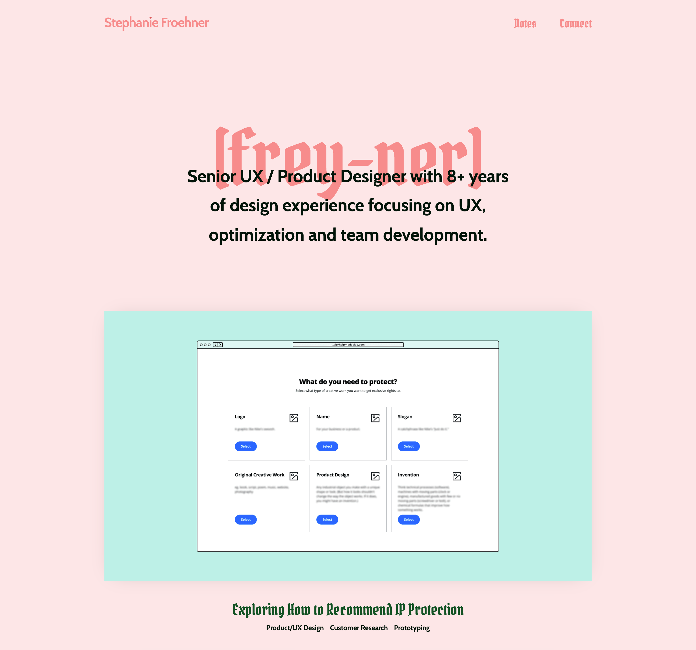
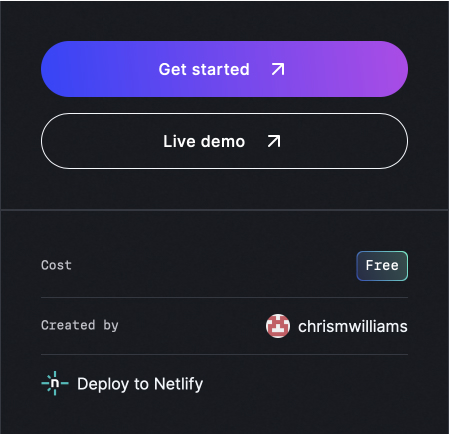

# Finally updating my portfolio -- for real this time!

I haven't had a major overhaul on my public-facing portfolio in YEARS, 4ish? It wasn't really a huge problem and I was able to get 2 great jobs with it. 



I also built a new redesign about 2 years ago and never launched it. (A shame, because it was cute!) Then, my chosen CMS, Forestry.io, was discontinued/depricated in April of this year... Not being able to update it anymore was kind of stressing me out (what if I find a typo I haven't noticed in 5 years?!)

In the past I've used Stackbit to generate a site and then modified it to my liking. My unreleased portfolio relied on Forestry, Gridsome, and Netlify. I didn't love Gridsome, so I was interested in trying something new.

I googled a bunch of ways to get a new template on Netlify, I opened every link for a template... I was looking for something FAST, lightweight and easy enough that I didn't have to spend a ton of time getting it up or learning, but different enough that it was fun to work on and learn. Then I just deployed one. 


It was SO easy to deploy directly from [Astro's theme page](https://astro.build/themes/details/astro-cactus/) - literally 1 click! I remember sitting on my couch late one night and tilting my head back and laughing because I was feeling totally lost until it was just NO BIG DEAL to have a brand new site to start editing. 

So far Tailwind CSS and Markup have been really easy to get used to and I don't really miss having a CMS layer to my website. Easy!!

---

# This rest of the page is for seeing a bunch of different markdown elements

## This is a H2 Heading

### This is a H3 Heading

#### This is a H4 Heading

##### This is a H5 Heading

###### This is a H6 Heading

## Horizontal Rules

---

---

---

## Emphasis

**This is bold text**

_This is italic text_

~~Strikethrough~~

## Blockquotes

> Blockquotes can also be nested...
>
> > ...by using additional greater-than signs right next to each other...
> >
> > > ...or with spaces between arrows.

## Lists

Unordered

- Create a list by starting a line with `+`, `-`, or `*`
- Sub-lists are made by indenting 2 spaces:
  - Marker character change forces new list start:
    - Ac tristique libero volutpat at
    - Facilisis in pretium nisl aliquet
    - Nulla volutpat aliquam velit
- Very easy!

Ordered

1. Lorem ipsum dolor sit amet
2. Consectetur adipiscing elit
3. Integer molestie lorem at massa

4. You can use sequential numbers...
5. ...or keep all the numbers as `1.`

Start numbering with offset:

57. foo
1. bar

## Code

Inline `code`

Indented code

    // Some comments
    line 1 of code
    line 2 of code
    line 3 of code

Block code "fences"

```
Sample text here...
```

Syntax highlighting

```js
var foo = function (bar) {
	return bar++;
};

console.log(foo(5));
```

## Tables

| Option | Description                                                               |
| ------ | ------------------------------------------------------------------------- |
| data   | path to data files to supply the data that will be passed into templates. |
| engine | engine to be used for processing templates. Handlebars is the default.    |
| ext    | extension to be used for dest files.                                      |

Right aligned columns

| Option |                                                               Description |
| -----: | ------------------------------------------------------------------------: |
|   data | path to data files to supply the data that will be passed into templates. |
| engine |    engine to be used for processing templates. Handlebars is the default. |
|    ext |                                      extension to be used for dest files. |

## Images

Image in the aliased assets folder: `src/assets/about-astro.png`


## Links

[Content from markdown-it](https://markdown-it.github.io/)

## Quotes

"Double quotes" and 'single quotes'

________________________________

# Quick recommendation:
**Nimona** on Netflix! I laughed. I cried. It was very cute (and metal).
