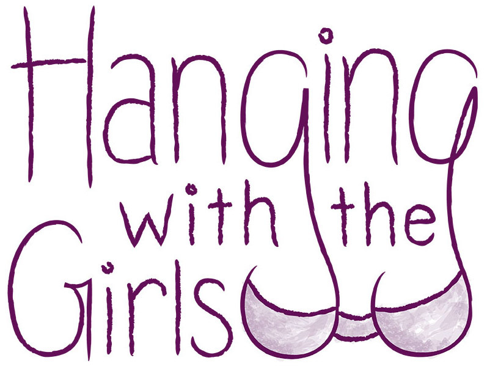
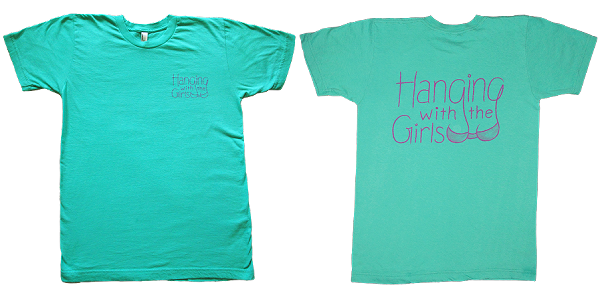
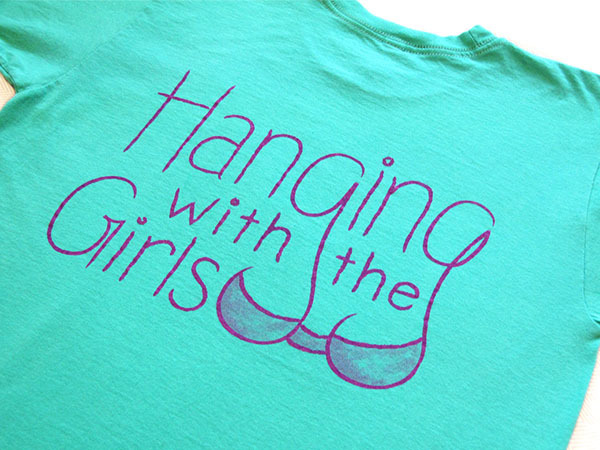

Hanging with the Girls is a Relay for Life team in Ridgecrest, CA. The leaders of the team came to me with an idea for a shirt design (boobs in the g's), which I sketched on my iPad over coffee with them. 

They liked it, and I thought their idea was hilarious so I went from there. I had the t-shirts printed and I made about 100 pins because I had so much fun with the team. I walked the 4AM shirft and had a fun night sleeping under the stars. 

Love you Traci, Karen, and Becky! 
