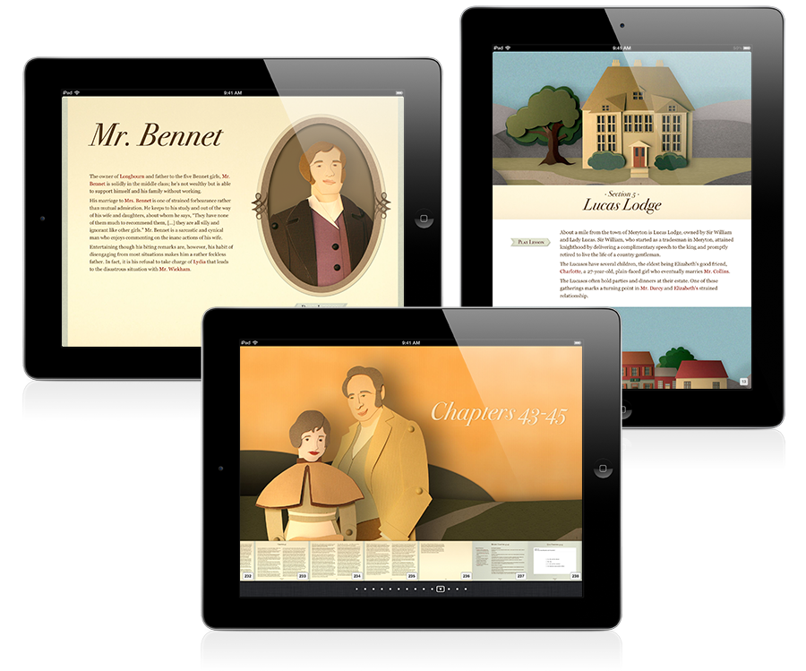
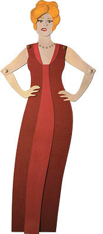
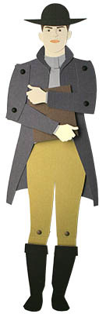
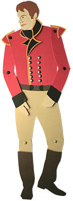
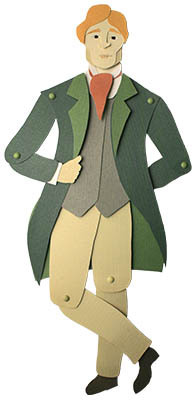
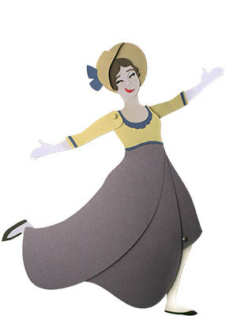
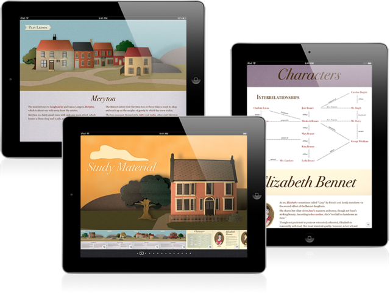
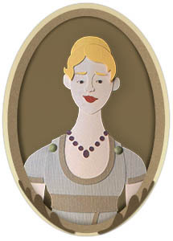
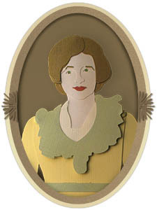
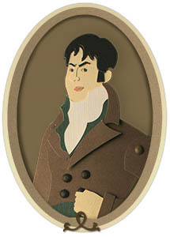

<iframe src="https://player.vimeo.com/video/45865804?badge=0&amp;autopause=0&amp;player_id=0&amp;app_id=58479" frameborder="0" allow="autoplay; fullscreen; picture-in-picture; clipboard-write; encrypted-media; web-share" referrerpolicy="strict-origin-when-cross-origin" style="position:absolute;top:0;left:0;width:100%;height:100%;" title="Pride &amp; Prejudice Trailer"></iframe>

This interactive ibook combines the full text of Pride & Prejudice with summaries, analyses, text and video study guides, quizzes, and a character map. Apple chose this iBook as one of its favorites of 2012 and gave it top promotion in the iBookstore. 

**Roles in this project:** Cutting and constructing all the paper assets for the book, designing the character map, typesetting and assembling the entire book in iBooks Author in both landscape and portrait view, designing the book cover, and delivering the files to Apple. Responsibilities for the promotional trailer include writing the script, directing the talent, and executing the stop motion cinematography.

**Big thanks to Zack for drawing the illustrations!!!**
