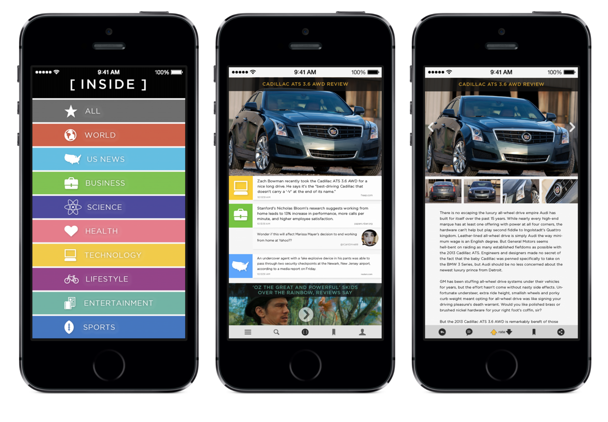
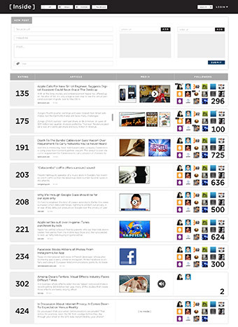
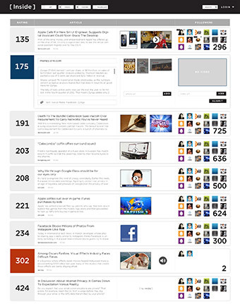
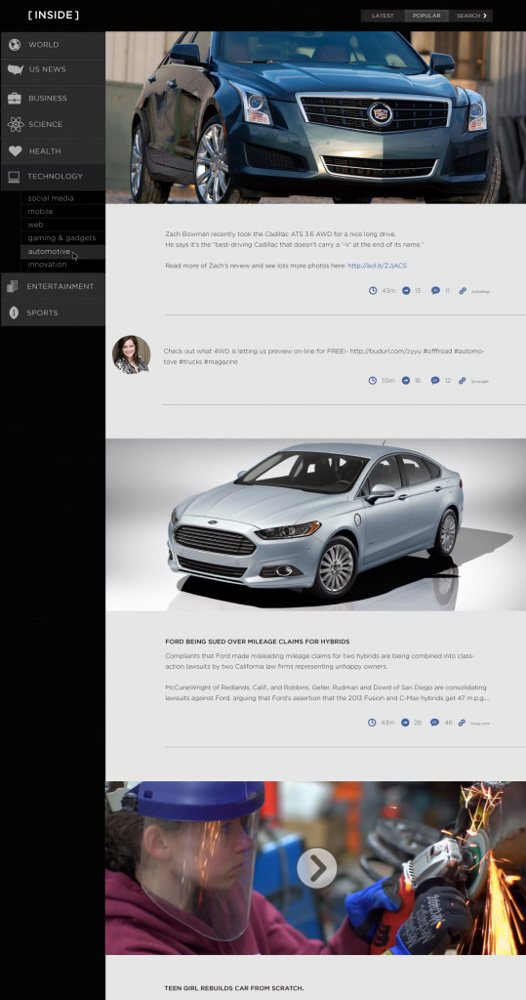
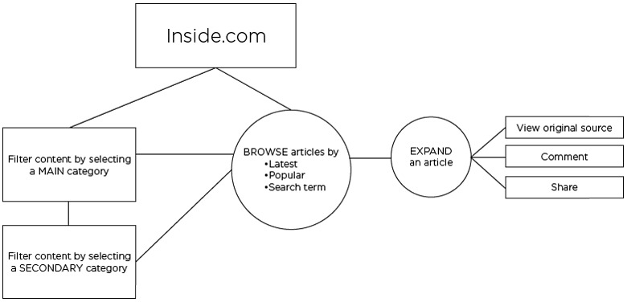

This is an early version of Inside.com's consumer and CMS views. Both were designed with speed and efficiency in mind. The CMS was designed to be able to rely fully on keystrokes, no mouse.

The app's objective was to provide a pleasing, visual way to skim the latest breaking news from various sources (Twitter, Facebook, blogs, etc.), and to be able to expand articles when it interested the user. 

Articles were ranked by content creators (power-users and experts) that shose the content in the CMS view. 

Users could filter content by using main and secondary categories. Categories narrowed so the user can be in the know for all things of that topic, for example, they could read everything "Inside Automotive."

