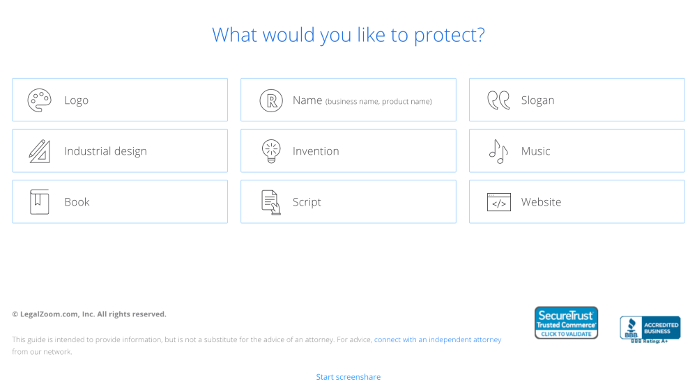
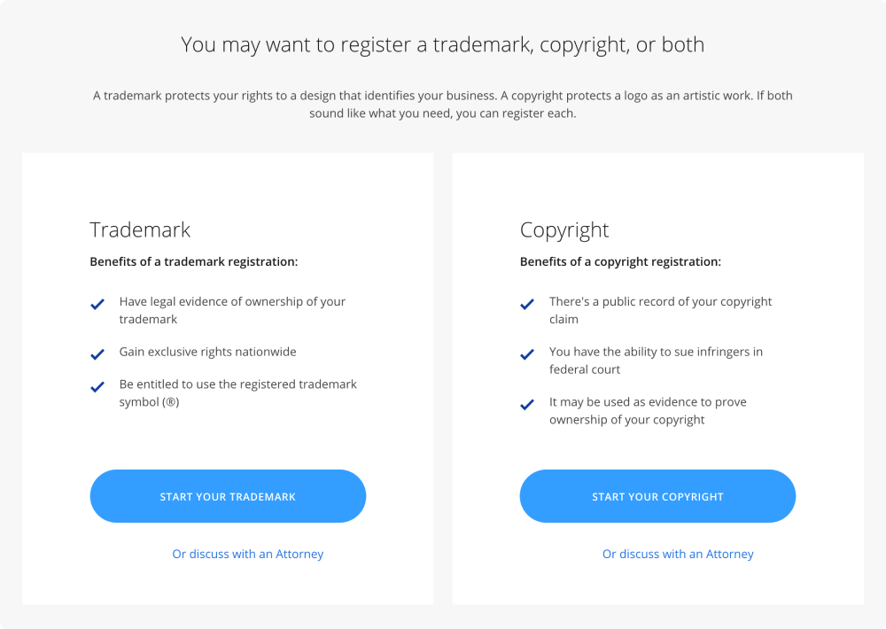
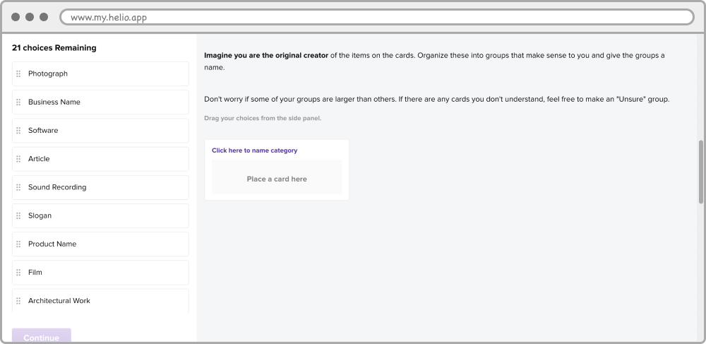
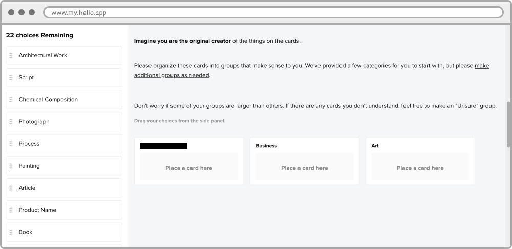
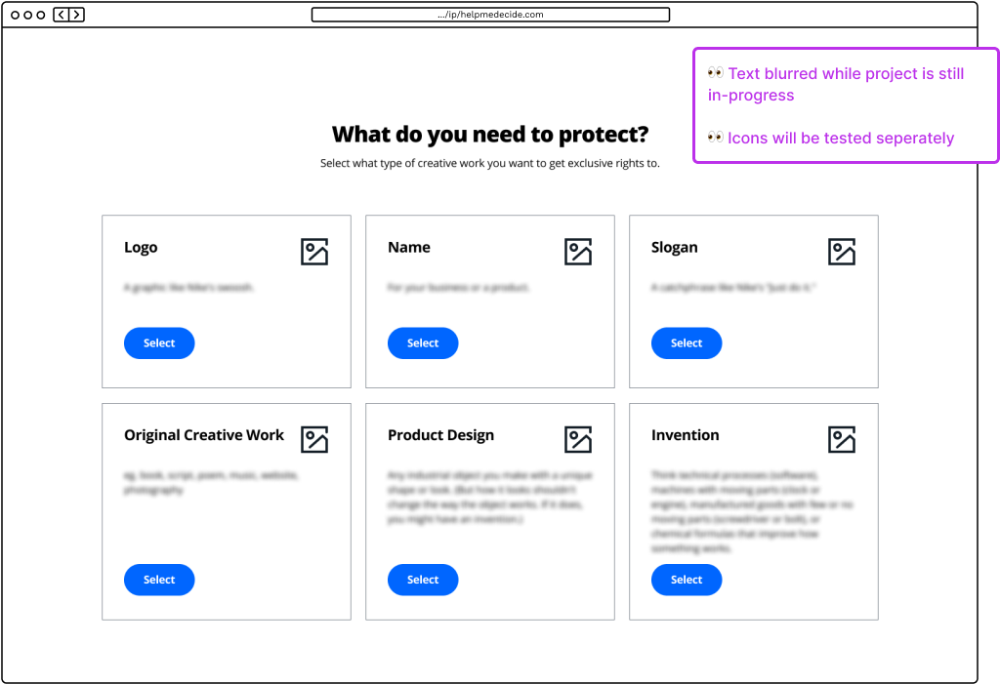
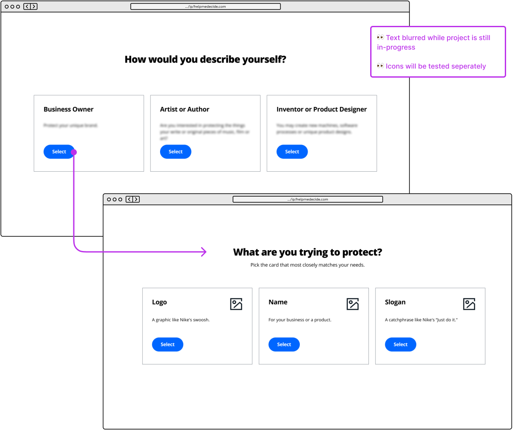
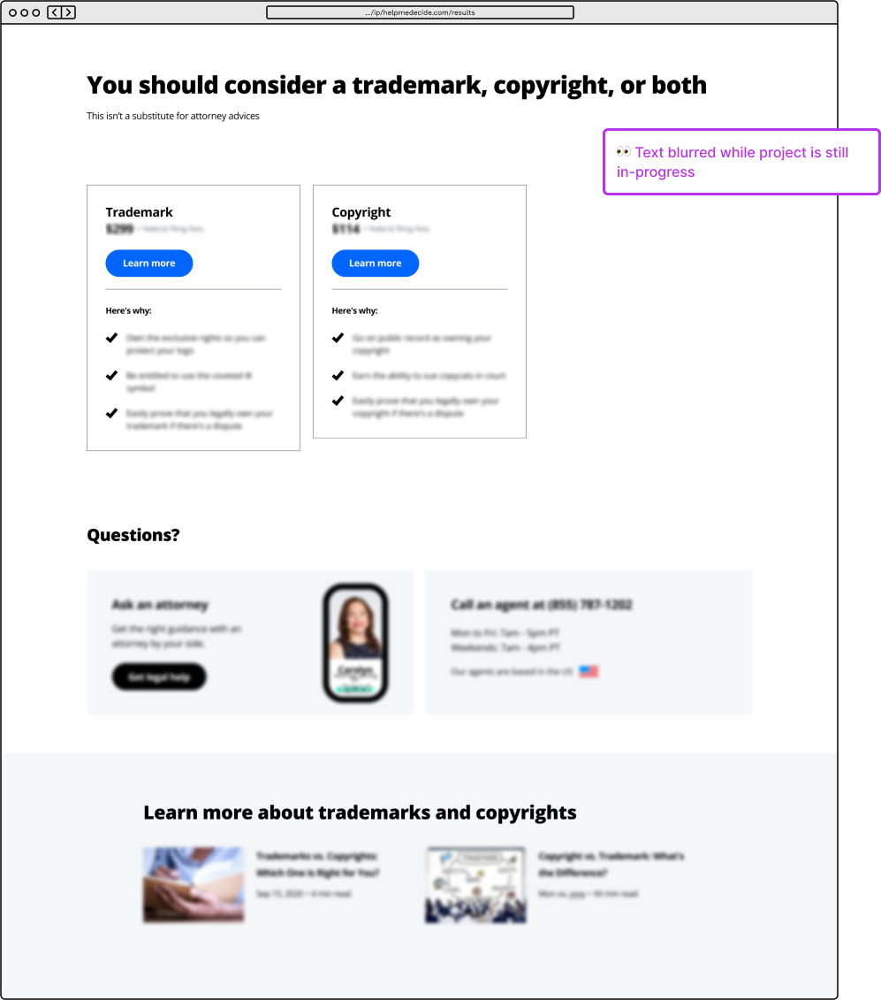

# Background

- Broadly, our research has shown people want quizzes or recommendation wizards to narrow down the different legal services they may need.
- For Intellectual Property (IP) LegalZoom has a simple 1-question Help me decide tool on the IP Category page. Testing participants would often be excited to see the CTA button, but found the actual experience and recommendations disappointing.
- This work was done in concert with a case study project for [Smashing Magazine Behavioral Design Workshop](https://smashingconf.com/online-workshops/workshops/behavioral-design-susan-guthrie-weinschenk) (highly recommended!)

## Goals & Requirements

### Customer Goals
- **Small business owners:** protect their business name and products, be legally compliant, and set up their business correctly.
- **Musicians, artists & writers:** protect their songs, scripts, books, etc. and prevent others from copying or profiting off their work.
- **Inventors:** claim their new product, invest in protecting their work now, for future benefits/gains.

### Business Goals
- Customer understands the product offering and **purchases the correct service** for their needs.
- Customer is able to purchase & complete their application **without Customer Care assistance**.
- Customer **purchases Attorney Assist** if they have any unanswered legal questions.

### Redesign Constraints
- Conserve dev resources. Aim for copy and image changes.
- Design for future design system compliance.
- Fix any large problems - identify “no regrets” changes.

## The Original Experience

### Behavioral Design Workshop Evaluation

#### Step 1: The Quiz

- Currently an unordered group of 9 items.
    - Studies have shown people make decisions easier with less choices.
    - It’s difficult to predict content when there is no order.
- Icons have inconsistent levels of complexity. The more complicated icons are too difficult to break down into [geons](https://en.wikipedia.org/wiki/Geon_(psychology)#:\~:text=Geons%20are%20the%20simple%202D,of%20objects%20in%20the%20brain.), which would allow customer brains to recognize the icon quicker.
- Language may not match how customers classify their work.

#### Step 2: Recommendation Page

- Data/reasoning behind the results is not included. Users expect to be aided in decisions. Not all results provide a clear recommendation or a way to decide on a product.
- Pricing and packages and LegalZoom’s role are not clear on results page.
- Do users expect to find out what protection our IP services offer, timelines, and level of effort?

### Data
- ~30% get the “Trademark” result, 15% get the “Copyright” result, and 14% of people get the combination “Trademark and Copyright” result  the numbers get smaller from there.
    - Either there is less appetite for patents or this experience suppresses those choices.
- About 20% of the traffic clicked back or on the logo to go to the homepage. This tells me they didn’t want to answer the question, “What would you like to protect?” but also didn’t want to leave LegalZoom.
    - The options might be too specific (they don’t see exactly what they are trying to protect) or too difficult to understand (what exactly counts as an industrial design?).
    - Some folks even called customer care directly from this page.
- Over 35% of the previous pages were results pages.
    - Users don't trust the results and took the quiz again.
    - Users were not convinced to click the product CTA on the results page - instead clicked back to return to the quiz and back again to the category page.

# Design Process

## Questions
1. Are these 9 options representative enough of the things our customers want to protect?
2. How would our potential customers classify and sort IP?
3. What kind of language do they use?
4. What kind of classifications do they expect?
5. Where are the potential gaps in the choices we provide?

## Customer Research

### 1. Card Sorting

I picked about 20 commonly protected works (e.g. photograph, process, book, invention, logo, song) from the United States Patent & Trademark Office, various online services—including LegalZoom—and asked participants to sort the cards into groups and answer a short survey.

#### Phase 1: Open

- Participants were tasked to create and name their own categories.
- "Art" cards were overwhelmingly the easiest for folks categorize. Second was "business" - sometimes called “branding.”
- Seeing all the cards in groups helped solidify their classification *(like partitioning/the power of groups from the workshop!)*.

#### Phase 2: Hybrid

- I provided 3 categories from the Open results. Two categories were clear winners from the Open Card Sorting, the 3rd was experimental.
- Works that would require patents emerged as the hardest IP to categorize. (Low patent numbers site analytics too).

### 2. Prototyping
The variations are content-driven; the team decided to use the existing questionnaire component of the design system. Participants only saw one version and the results were compared. They had the same results pages.

#### Version 1: Optimized

- Keep the 1-question flow, but reduce the number of options to broad categories and add descriptions.
- **Hypotheses:**
    - Participants will be more successful if we reduce the number of options. The legal team and copywriters felt comfortable combining the “Art” choices since most of the card sorting participants always grouped those together.
    - Educating the users with descriptions and friendlier language will clarify the options. The confusing cards from the card sorting study were added as examples in the descriptions.

#### Version 2: Experimental

- Make a 2-question flow, partition people into roles (business owner, artist, or inventor) and have more specific choices on the second screen.
- **Hypotheses:**
    - If we use nouns to trigger group membership, users will feel more motivated to complete the first question. Adding a second, more meaningful question will improve the inconsequential feeling of the 1-question live experience.
    - We can reduce errors by utilizing the power of groups/partitioning and encourage people to think more about their selection. This is also an opportunity to add more choices - as card-sorting participants understood IP better when they could see the groups.

#### Recommendation Page

- Added clearer recommendation language, pricing, why consider a product, clear ways to get help, and educational content.
- Utilized pricing card, attorney/customer support, and article components from the design system.
- Experimenting to see how much can we reuse and where we need to invest more into the experience.

### Unmoderated Tests
First round is focused on our largest audience: future small business owners. The pages before and after the “Help me decide” experience - including the results pages were identical. Participants only saw one version and the results from the two studies were compared.

- **Version 1** participants had a very high NPS score and scored their confidence in the results as 5/5. However, only 3/7 got a recommendation for the correct IP protection
- **Version 2**'s NPS was 30 points lower and an average of 4.6 confidence score. Interestingly, all the participants chose the correct service!!!
- **Recommendation page** content isn’t enough to convince people these recommendations have any authority. People want more.

# Reflection & Next Steps

I thought these results were wild!

**Version 1**'s hypothesis of combining cards was considered a "do no harm" win to the team, but the results were still inaccurate and people were overly confident. I feel it was oversimplified and too easy to complete. Adding descriptions only helped those who read them (and lol, no one does that, they just skipped around to what could be "close enough").

**Version 2**'s partitioning to reduce errors is on the right track, but needs to be further proven with a larger sample size. I think it's very promising to ask people to slow down in order for them to get a personalized recommendation. The next iteration would have explored different ways to partition the choices without being overly technical.

I planned to continue to working on both versions until we have strong experiences that balance confidence, ease of use and accurate product recommendations - plus a Recommendation page that demonstrates that LegalZoom is the right provider for IP protection.

**Recommendation page** didn't provide content that would allow people to validate the recommendation and catch their errors. Next iterations will experiment with content like FAQs, statistics, real-life examples or case studies. The next rounds of unmoderated and moderated tests were to include broader audiences. 

- **Timeline:** ~4 weeks in Q3 2020, Phase 2 *was* scheduled for Q1 2021, but you know how these things go...
- **Role:** UX designer
- **Team composition:** Copywriter, attorney, product marketer and 2 designers
- **Company:** LegalZoom
