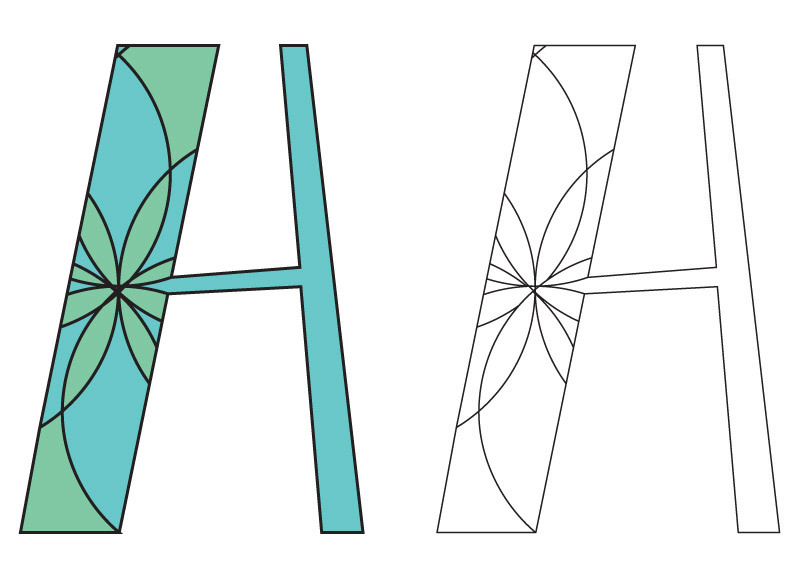
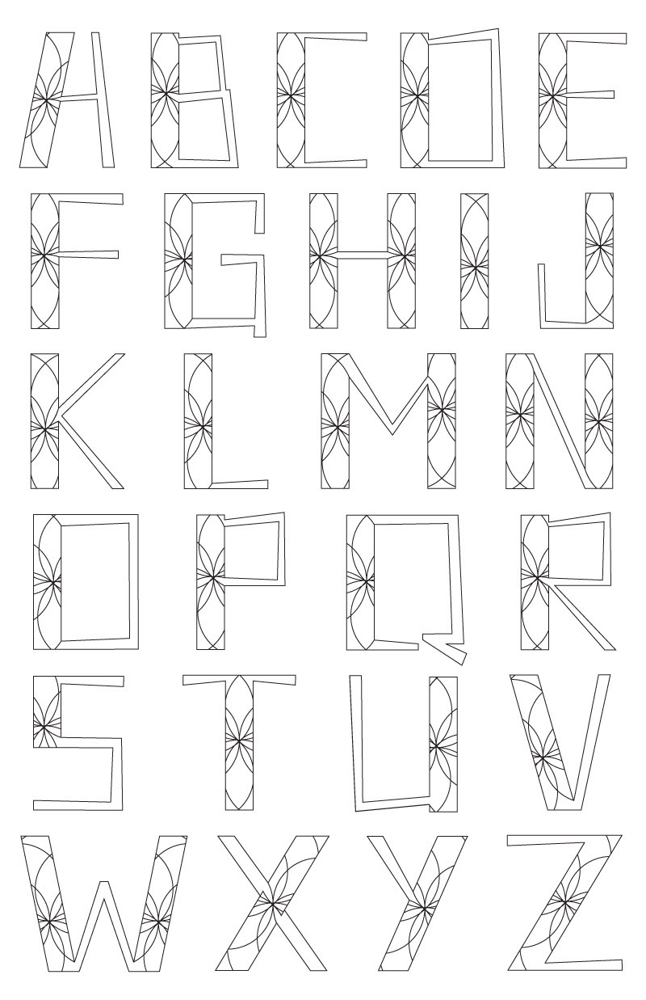

Miss Adair was inspired by the Dead Like Me character Daisy Adair, who was feminine, strong, and liked the idea (and the look) of Catholicism. She is a flawed but lovable character

*Project for Typography 2.*
