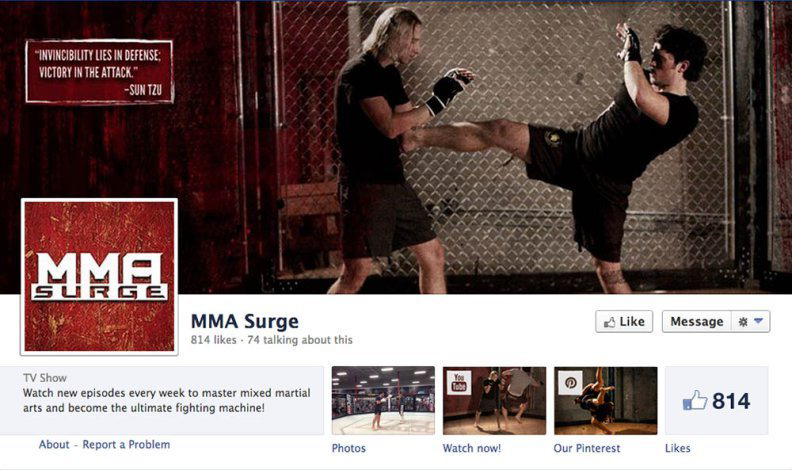
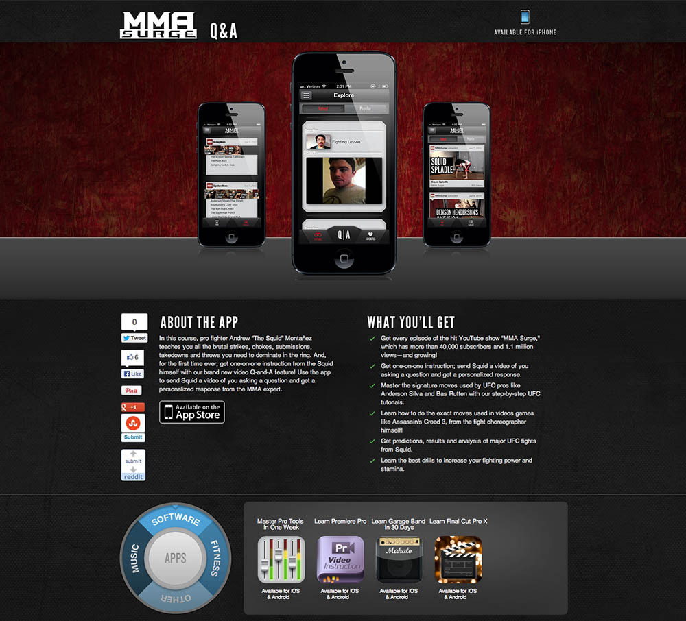
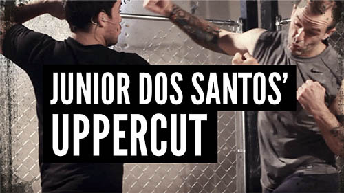
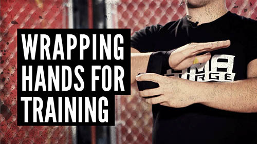

MMA Surge was a YouTube channel that not only taught martial arts, but also had UFC Fight predictions, fight reenactments, interviews with famous fighters, self-defense safety training, practice and training tips, and workous.
**Roles in this project:** Designing and building the set, (the cage and distressed red wall), designing and printing the shirts, creating the website and promotional material for the app, maintaining social media accounts (Twitter, Facebook, Tumblr, and Google+), and designing thumbnails for each episode's video. I worked with a team to establish branding and tone of the show. 

