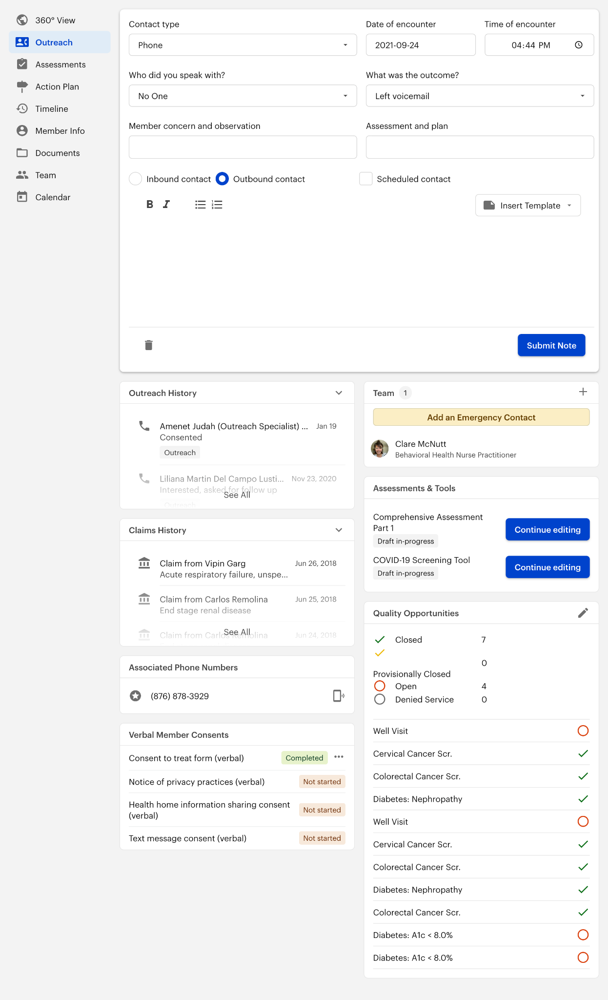

# Background
Cityblock is a value-based healthcare company that’s focused on the Medicaid and dually eligible population. They serve those with the most complex needs, and often with the least resources, in the way they deserve to be treated—with respect, compassion, dignity, and time.  

## Problems
- **Cityblock members do not know that they have Cityblock’s coverage** and need to be contacted and onboarded (“outreach” and “consented”). 
    - Our members may be distrustful of us; we're often starting at zero with them. 
- **Cityblock was rapidly scaling, and scaling across markets.** The outreach team struggled with a manual and complex onboarding process. 
    - Each market did things a little differently. All the differences needed to be taken ito account and operationalized. 
    - They needed to decrease the time it took to onboard a member *and* reduce the time it took to train an outreach specialist (OS), no matter their location.
    - OS leads needed more visibility into the work
- **Outreach had a workflow, but it was not integrated into Commons (Cityblock’s care system).** They used too many tools to keep track of and had to duplicate work to hand-off a member. 
    - Commons is a healthcare platform, where the care team manages their members. The outreach team used it, but it wasn't built for their purposes.
### Users  
1. Outreach Specialists (OSs)  
2. Outreach Leads  
### Stakeholders
The Head of Member Engagement and Operations leadership  
### Member Activation & Trust Team  
My Role: Lead designer (IC)  
My Squad: 1 engineer lead (Dan) 1 PM (Ari and then Bobbi)  
Support: Mike (research advisor and MA&T lead), Neves (design team lead)  

## Goals 
**Meaningfully improve the efficiency of our engagement funnel**  
Enable outreach specialists to spend less time researching and more on personalized conversations. Provide a guided workflow so that the team doesn’t have to remember each step, reducing documentation gaps, and increasing documentation quality. 

**Personalize outreach conversations to offer more value upfront**  
Surface details about a member and scripts, tips, and resources that will help the outreach team with the initial engagement conversation. Provide a space to operationalize early wins and other engagement experiments. 

**Support a centralized outreach team**  
Simplify workflows for outreach specialists, allow new employees to get up to speed faster, and minimize nuances across markets. 

**KPIs**  
- Increase conversion rate (specifically our highest need members)
- Increase call volume
- Reduce time spent on research
- Adoption (this one's important - working outside of Commons is less safe, but also means we can’t learn as much from their usage)  

# Discovery
Since we wanted a centralized outreach team and process, I had to understand what tools and workflows they were using across markets. We wanted to launch an MVP quickly so we can start getting wins and learnings to build upon. 

## User Interviews + Shadowing Sessions
- **Biggest need: accurate member information, faster**
    -   It often takes more than one outreach session to consent a member, so the OS needs to be able to carry the previous conversation. Knowing the member's history shows legitimacy. 
- **OSs use a lot of different tools and pages in Commons**
    - All the different tools slow them down and makes them need to rely on memory (this allowed for a lot of differences between OSs and didn't allow for controlled experimentation within markets). 
    - Commons had performance issues - it’s too slow to use in real-time
    - They use the calling tool, a script document, tracking Sheets, research tools and notepads for documentation
    - They also have to submit two notes within Commons: One Outreach note, and one Intake note.
    - There is an intake checklist UI, but it is not accurate and not being used
- **Consent conversations are not linear.** OSs often weave various parts of the intake process into natural conversation. 
- Documentation and handoff is very labor-intensive. OSs try to keep calls as short as possible, so **essentially consent workflow happens twice - verbally with the member and then documenting it in the system.**
- The gratification of helping members means the OSs do a lot of extra work without complaint. Their workflows were more inefficient than we realized.
- **The emotional impact of outreach**
    - The best part of an OS’s day is when they get to help (and consent) a member
    - The worst part of conducting outreach is the monotony (lots of ringing with no answers)
    - Often new OSs are more successful than more experienced ones, but it takes time to learn the system and the script
- **OSs need to have energy and enthusiasm when they talk to members**
>I think her overwhelming positive attitude made me just actually join before I could get off the phone with her because she was just too nice. And you wouldn't want to be mean to her. 
*- Recently consented member*

## OS Leads and Stakeholder Interviews
- **Biggest need: Integrated tools for tracking OS performance and smart campaign experimentation**
    - They use a ton of Google sheets for tracking OS performance, but that data stays in Sheets.
    - We need a tool that will pull in our data, claims/other medical data, and our internal research model to surface appropriate engagement tactics.
    - We can also get smarter about our OS superpowers. Some leads *know* they have OSs that are really great at speaking to specific types of members (like pregnant people, the elderly, etc.). Integrating that data into the member-assignment model could heavily impact our efficiency and conversion rates! 
    - OS performance is more complex than our tools can track right now.
- **They want to be able to cut down on training time and remove the amount of decisions an OS has to make.**
    - Clear workflows within Commons, so OSs always know what the next step is
    - Reduce the OS mental load by providing scripts and tests (like flu shot campaigns)
    - Relevant member information (what they might be struggling with the most)
    - OSs need to be able to connect with a member. They don't necessarily need to be health professionals.

## Software research

### Commons
- Technically, Commons had most of what the OSs needed, but everything was on a different page, and due to the poor performance (it loaded lots of other data too), it couldn't be used on the phone.
- OSs relied on their memory, not the data in front of them, to have a discussion with the members

### Point of Sale Software
  
[Source](https://dribbble.com/shots/15629660-Kopinan-POS-System-for-Coffee-Shop)  
  
[Source](https://posquote.com/best-restaurant-management-system-online-pos-posquote)  
- Everything relevant is available on one page
- Data collection is easy and standardized
- We can Shorten the time it takes to consent a member by creating the documentation on the call; OSs could have a conversation with the member while also gathering accurate information.

# MVP

The member’s outreach page is the base of the outreach and intake workflows in Commons. It contains shortcuts and widgets to facilitate easier outreach phone calls and member handoffs. 

## Feature Prioritization
1. **Validate and streamline workflows with Stakeholders** - what work is actually necessary, what can be simplified across markets.  
Stakeholders didn't know all the complexity across markets and workflows. We aligned on the outreach needs. They were close to the existing flow, but we agreed to do less manual tracking wherever possible.
2. **Where are the biggest inefficiencies?** Like double documentation and all of the different tabs and clicking within Commons.
3. **How can we get better data while reducing user effort?** New KPIs: # of tabs open and # of Sheets/market. 
4. **Work with eng partner (Dan) to find the easy wins** - He wrote a script to duplicate the notes so Commons still worked, but the user could do half the work. We did this before actually building a proper fix so we can immediately reduce the work and build a little trust with the OSs. 
5. **Rank features by asking the OS’s,** “What is the worst part of your job?” Attitude impacts the outreach success, so the better moods we can get the OSs in, the more effective they'll be (also, it's the nice thing to do) 

## MVP Features
### Notes
- This is where you will document the member call. 
- Use this note instead of launching the Outreach / Intake modal from Actions. 
- If you consent a member, you can add a handoff template 
- An update to this feature is in progress. Soon this will look more like the feature-rich notes on the Timeline page.
### Outreach & Claims History
- **Outreach History** gives a snapshot of who on the Cityblock team the member has spoken to thus far. This helps to you pick up where other conversations left off.
- **Claims History** is shortcut to get a picture of a member’s history and recent care.
- You can click to expand and read details.
### Associated Phone Numbers
- The phone number with the star in a circle is the member’s primary phone number.
- The other numbers are from the Member Info page.
- Click the phone icon on the right to call.
### Verbal Member Consent Documents
- This widget is a shortcut to the consent documents completed over the phone. 
- Click the document to open and complete.
- All other consent documents are in the “Documents” page on the member’s profile. 
- After MVP, we planned to cheat the performance problems by pre-filling the forms - the OS would say the member consented, then generate all the proper documents with a click. 
### Team
- Click the yellow button to add an emergency contact.
- You can add any type of the member’s team from this widget by clicking the plus icon in the top right corner of the widget.
- To edit the team, click “Team” at the top of the widget or go to that page from the navigation.
### Assessments & Tools
- This widget is another shortcut to commonly used Assessments & Tools.
- You can also view previously completed Assessments & Tools or continue editing a draft.
- ### Quality Opportunities
- Quality opportunities are another way to approach discussing a member’s needs

## Rollout
Our team had 1 launch goal: Every OS tries it at least 1x in the first 2 weeks of release.  
To get this done, we wanted to make the new page as approachable as possible, and make the product team as accessible as possible. It's hard to change your daily workflow when your performance metrics don't change.    
1. Kickoff meeting with training materials
2. Pendo tutorials and surveys
3. Feedback Slack channel for all OSs - they need to have a voice!

# Impact and Additional Learnings
- **My wins:**
    - OSs felt ownership of the Outreach page, they referred to it as “our page”
    - We eliminated the need for ~5 Google Sheets/market, ~4 tabs for outreach sessions
- **Leads were happy that the page decreased training time.** It also increased their confidence in new OSs and allowed them to be more focused on the human aspect of outreach.
- **The learnings from this project drove incentive conversations with stakeholders.** We needed to address our performance metrics being in conflict with our company goals.  
## KPIs
- **Increase conversion rate (specifically our highest need members)** 
    - We did increase conversion rate, but not for our highest need members
    - Our highest need members simply need more research and we need to incentivise that appropriately. 
- **Increase call volume** 
    - We significantly increased efficiency and OSs were able to increase their calls per day. 
    - We learned that call volume as the main OS performance indicator did not mean we consented more high-need members.
- **Reduce time spent on research** 
    - Research on “easy” consents was reduced, but highest need members was not impacted by this.
    - Our highest need members require additional research, and we need to have the OSs that excel in research focus on these members! 
- **Adoption**
    - All the markets used the new page, new OSs used it exclusively and most old OSs used it too (I also reached out to any stragglers to understand more)
 
#### My Thanks:
- Huge shoutout to the MA&T Team <3
- Kim D. and all the OSs and OS Leads that partnered with me for this - many thanks
