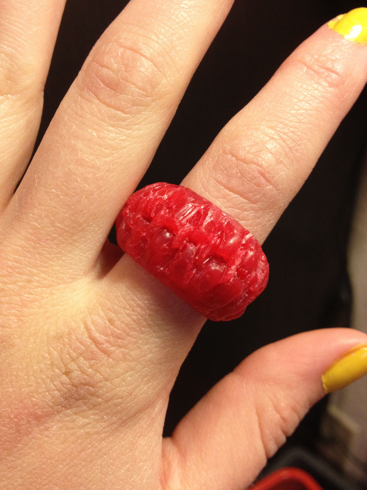
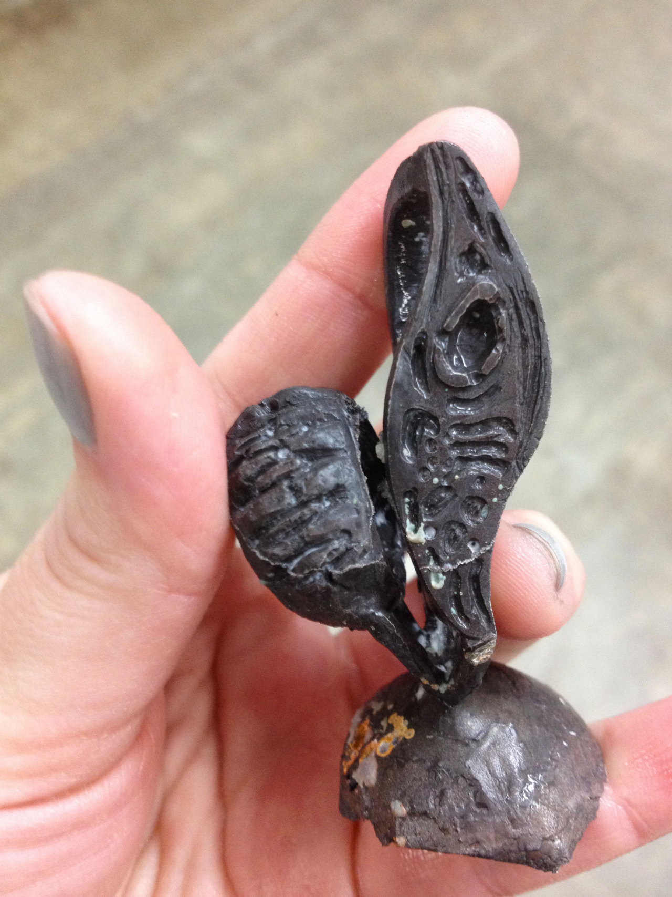
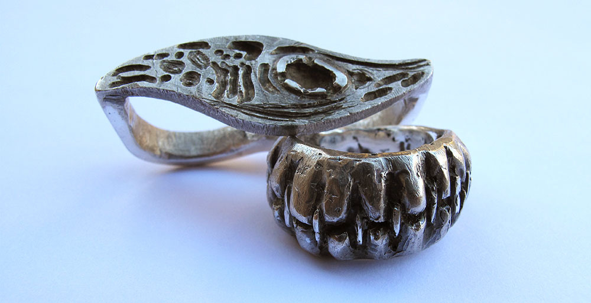
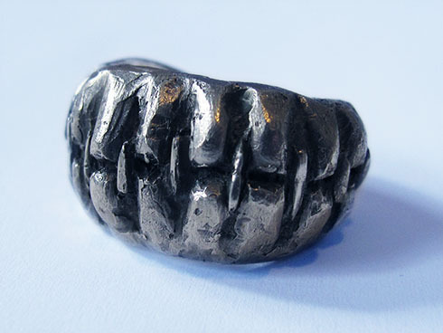
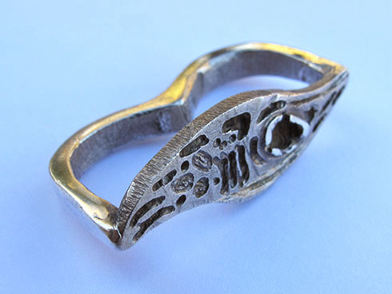

Process photos for a casted silver ring set. These pieces explored how wounds are healed; the theme for this assignment was "Man vs. Nature." 

People heal wounds with sutures, but at a cellular level, myofibroblast cells repair wounds by contracting the edges of the would.

*Project for Matal Jewelry Making 1*
