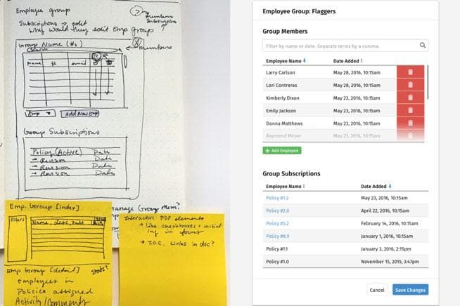
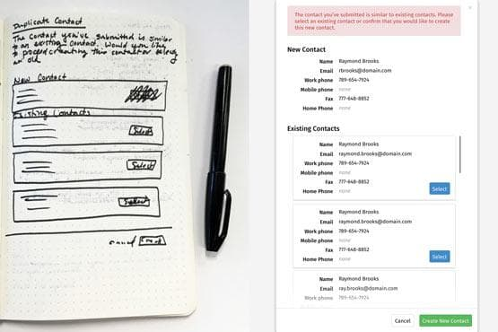

# Background
Unity is a central data hub for TMI's entire business and connects to a companion iPad app for field employees.

## Problem
TMI was using a Microsoft Access application to manage all their resources. It was slow and clunky after being developed over the life of the company; it could no longer scale with the growing business.

## Goals
- **Better user experience.** Implement a feedback loop and reduce frustration. How can we make their workdays a little easier?
- **Reduce errors.** Everyone used the previous solution a little differently. The system did not prevent discrepancies.
- **Standardization.** Reduce "hacks" and employee workarounds. Eliminate tech debt and use consistent data conventions.
- **Scale.** Be expandable and adaptable to evolving business needs

## Requirements
- One system to handle all day-to-day operations
- Convenient mobile access - eliminate the need for Remote Desktop
- Clean, reliable data

## Audience
Unity is used across the company. Access, capabilities, modules and views were based on roles.
- Estimating and sales
- Project management
- Dispatch, vehicle and equipment management
- Contact management
- Human Resources (policies, payroll)
- Billing

# Design Process
Because Unity is a system, we established a repeatable process.

## 1. Research & Discovery
- **Stakeholder Interviews & Workshops:** establish the purpose and business requirements
- **User Interviews & Observation:** Get into the field and observe and document how people are solving the problem/using the old system now. We need to understand the people using the module.
- **Heuristic/Usability Review:** If we are redesigning an existing module, where can we apply best practices
- **Competitive/Comparative Analysis:** How have other people solved these problems? What can we learn from industry standards? Where will we innovate?

## 2. Plan & Strategize
- **Brainstorm Solutions:** Whiteboards, workshops, and sketching constraint-free ideas.
- **User Flows & Task Analysis:** map out the user’s flow to complete the tasks and how it fits into the larger system. Where else will this data be used?

## 3. Design

- **Sketches:** Work out solutions on paper/whiteboard
- **Wireframes / Low Fidelity Mockups:** Show stakeholders and developers loose ideas to get feedback; work with the other designers to make sure the design system will be applied consistently and components will be reused effectively
- **Interactive Prototyping:** Make solutions look and feel “real” and ready to validate
- **Validation:** Return to the people we are designing for and ask them to complete their tasks using our prototypes. Iterate if we identify any gaps in the experience.
- **Documentation / UX Plan:** Outline every interaction state, edge case and everything else the engineering team may need to build

## 4. Development

- **Collaborate:** Work with developers as they build the modules and QA throughout the process.
- **Write release notes:** People using Unity need to know what was changing, why, and how they can provide feedback.

## 5. Feedback & Monitoring
- **HotJar:** I watched playback sessions to find opportunities to improve and addressed all incoming feedback.
- **Google Analytics:** Benchmarking and tracking behavior allowed us to use data to drive decisions.

# Results
We designed for accessibility and listened to user needs to improve the experience.

## Highlights
- Reduced design and development time by using repeatable patterns.
- Implemented a performance budget. Unity is more lightweight and much faster to use than their previous solution. A budget allowed us to balance design and engineering decisions.
- Every module can adapt to a wide range of content sizes, meaning TMI is not constrained by project or client size.

Modernizing the technology (Google for Work authentication, cloud-based hosting, responsive web components) made data more accessible and usable in and out of the offices.

- **Date:** 2015 - 2017
- **Role:** Design team lead and product designer
- **Team composition:** 3 designers, 5 engineers, 1 project manager
- **Company:** FiveSixTwo, Inc.
